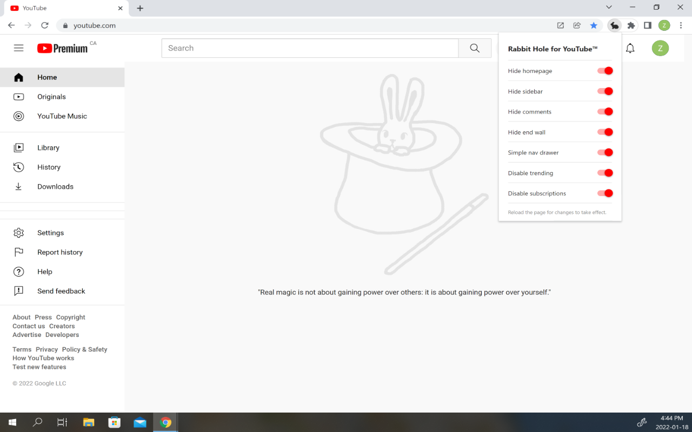

# YouTube Rabbit Hole

Chrome extension to remove YouTube recommendations, comments, and more so you don't go down the rabbit hole again!

## Features

There is magic, but you have to be the magician. This extension allows you to take control of your time and reduce distractions while browsing YouTube in the following ways:

- Replace suggested content with cute bunnies!
- Hide comments (including livestream chats)
- Disable the trending and subscriptions pages
- Simplify the navigation drawer
- Disabling the wall of suggestions following a video
- Hiding banner-style ads to maintain a clean and distraction free environment

You can click the browser action in the toolbar to view and edit preferences.
 
## Screenshots

*YouTube Homepage*

*Video Page*

*Customizable Preferences*

## Install

To install, head over to the [listing on the Chrome Web Store](https://chrome.google.com/webstore/detail/youtube-rabbit-hole/nlddakjbmpidooplakalfoogdincflfh/) and click "Add to Chrome". That's it!

## License
This open source project is licensed under the MIT License. View the source code [here](https://github.com/anthonyftwang/youtube-rabbit-hole)!
